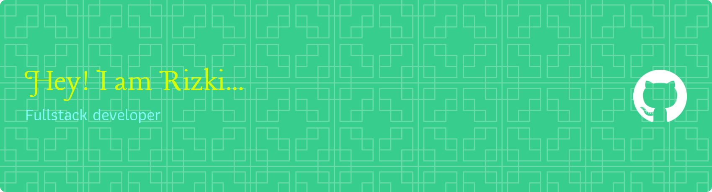

## Hi! Nice to see you 👋

Hi there 👋 I’m Rizki, a Fullstack JavaScript Developer who loves building modern web applications. I’m currently open to full-time opportunities or freelance projects where I can contribute and grow.  Right now, I’m also expanding my backend skill set by learning Go (Golang) and PHP Laravel, because I believe in continuous growth and adapting to different technologies.

# 💻 Tech Stack:

                                                        

### ✍️ Random Dev Quote

<!-- Proudly created with GPRM ( https://gprm.itsvg.in ) -->
